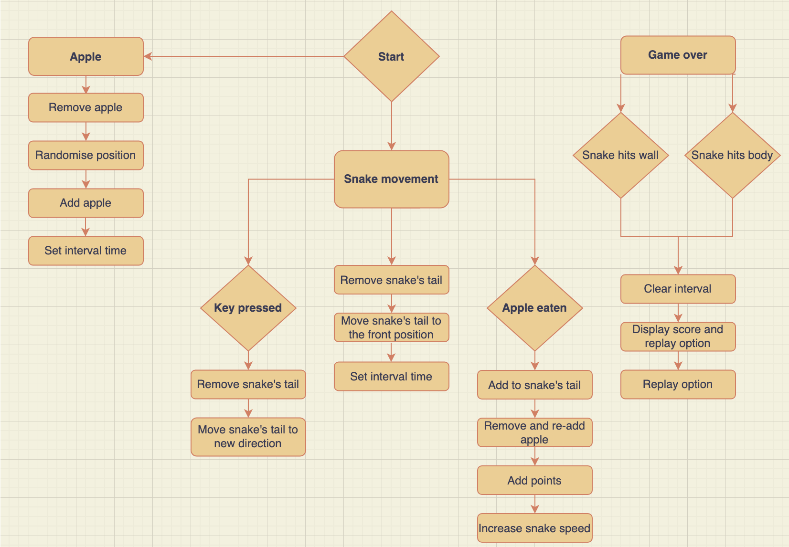
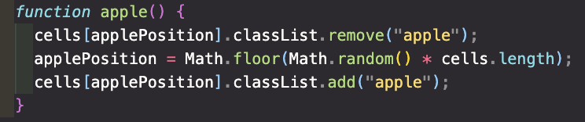
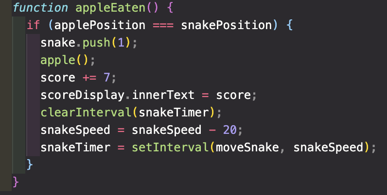
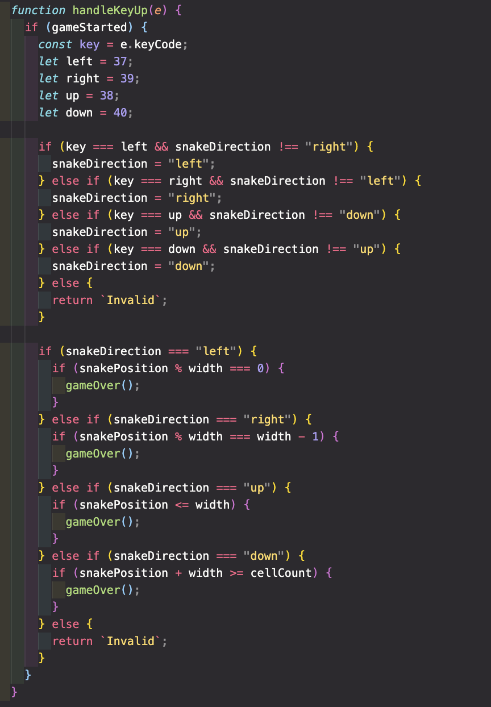
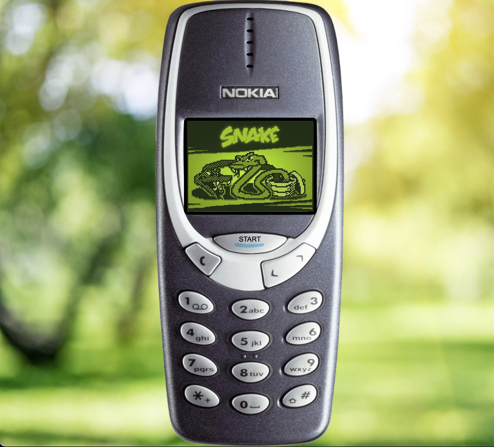

# Project 1: Readme

# Description

For the first project on General Assembly’s Software Engineering Immersive course, we were assigned the task to build a game of our choosing. We had a two-week timeframe to put to test all of the HTML, CSS, and JavaScript learnt over a month and a half. I decided to go with a classic that I spent an inordinate amount of time playing as a child on a navy blue Nokia brick phone: Snake.

If you have never heard of the Snake game or you can’t quite remember it, here is a summary: a player guides a snake to eat an apple that will earn the player points, grow the Snake’s body and speeds up its movement. The purpose of the game is to stay alive as long as possible. If the Snake hits the wall or its body—it’s game over!

The technical requirements set on the game included the need to:

1. Render a game in the browser
2. Design logic for winning and visually display which player won
3. Include separate HTML / CSS / JavaScript file
4. Employ the KISS (Keep It Simple Stupid) and DRY (Don’t Repeat Yourself) principles
5. Use Javascript for DOM manipulation
6. Deploy your game online, where the rest of the world can access it
7. Use semantic markup for HTML and CSS (adhere to best practices)

## Plan

Oh, I do love a good planning session. The first order of business was to categorise the game’s functionalities into four broad areas:

1. The Snake’s movement and direction
2. Randomised apple generation
3. Removing the eaten apple, adding points, and increasing the Snake’s body length and speed
4. Collision detection

The JavaScript is organised under three sections: elements (elements to select and variables), execution (functions), and events (event listeners).

To aid my planning, I used Todoist to keep track of my tasks for each section, and a flowchart to visualise the course of the application:

## Build/Code Process

The programme begins with the elements and variables selected under the elements section. Included here is the Snake in the form of an array. This section also sets up the structure of the game in the form of a 20 by 20 grid. The grid is dynamically built using a for loop that pushes an array of divs into an empty cells array and appends them to a div container with a class of grid.

The next section of the programme is the execution, the meat of the programme. Beginning the game is the startGame function which runs when the Nokia's start button is clicked. This function sets the gameStarted variable to true, randomly places an apple on the board every 20 seconds, and kicks off the Snake's movement to the right every 0.4 seconds.

The Snake’s direction (i.e., where the Snake's head moves to) is determined under the next function getNewCell. If the Snake heads to a wall, the function invokes the gameOver function.

The snake movement function (moveSnake) firstly uses a forEach to assign each element in the Snake array with a class that holds an image of the Snake’s body. The movement of the Snake is as follows:

1. Assign a newCell variable to the getNewCell function outlined above
2. Remove the Snake’s tail using the array pop() method and remove the Snake class from the tail
3. Use the array unshift() method to push in the newCell position (i.e., the direction of the Snake’s head) and add the Snake body’s image to the newCell position
4. Assign the snakePosition (i.e., the Snake’s head) to the newCell position

The moveSnake function is set to an interval that (initially) runs every 0.4 seconds and also invokes the functions that check if an apple has been eaten and whether the Snake has crashed into itself.

The following two functions are the apple function and the AppleEaten function. The apple function manipulates the set applePosition variable to randomise its position:

The appleEaten function checks if the applePosition is equal to the snakePosition, and if so, regenerate an apple, update the score, and speed up the snake:

To check if the Snake has crashed into itself, the Snake body is firstly split from the Snake head using the slice array method. Using the includes array method on the Snake body, the Snake head is then checked if it exists within the body array. If so, the gameOver function is invoked.

A keyup event for arrow-keys was used when changing the Snake head's direction. When either of the left, right, up or down arrow keys are pressed, the snakeDirection variable is updated to reflect the pressed arrow key. This function also calls the gameOver function if the pressed arrow key guides the Snake to a wall:

The gameOver function displays a modal that shows the player their score total and the option to play again. When the game ends, the Snake and apple classes are removed from the grid, and the Snake's movement and apple generation timers cleared.

## Challenges

The greatest challenge of the game is (unexpectedly) CSS related. The goal was to have the CSS look as follows:

However, despite my extensive tweaking of the CSS and HTML, the application is only responsive (though unfortunately zoomed) until 992 pixels, after which the grid shifts above the phone.

## Wins

I’m most pleased with handling the keyup event. It wasn't greatly challenging, but it did require a fair bit of fiddling to get right.

## Key Learnings/Takeaways

Completing this project has greatly raised my programming confidence. It feels like this game has added some more pieces to the jigsaw puzzle of programming, and I am now starting to see a picture emerge. I know I have many more pieces to add, but it is undeniable that the puzzle is becoming clearer as the days go by. I’m so very excited to keep playing.

## Bugs

No bugs to report (woo!).

## Future Improvements

To further improve this game, I hope to make it mobile responsive, add a high score and enable clickable buttons with the audio of a Nokia phone button press.
